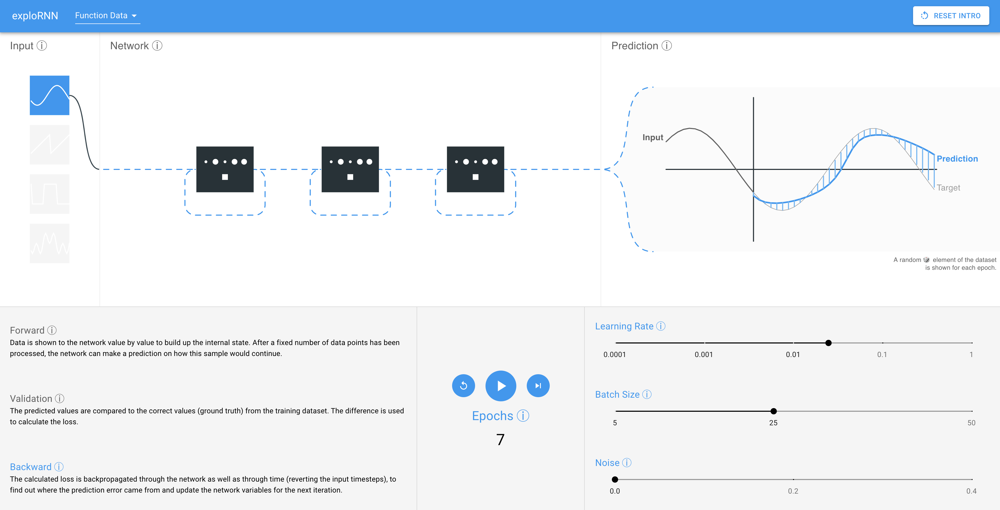

# exploRNN: Understanding Recurrent Neural Networksthrough Visual Exploration

Created by <a href="https://a13x.io" target="_blank">Alex Bäuerle</a>, <a href="https://twitter.com/RaphaelStoerk" target="_blank">Raphael Störk</a> and <a href="https://www.uni-ulm.de/in/mi/institut/mitarbeiter/tr/" target="_blank">Timo Ropinski</a>.

Accessible <a href="https://mi-pages.informatik.uni-ulm.de/exploRNN" target="_blank">online</a>.

## What is this?

exploRNN can be used to interactively learn about the concepts and properties of recurrent neural networks (RNNs)

## How does this help me?

If you want to learn about RNNs, and know some basic about deep learning already, this is the application for you.
It will teach you basics about RNNs, from which you get a good overview of how these networks function, an what they can be used for.

## How can I use this?

Just go to our <a href="https://mi-pages.informatik.uni-ulm.de/exploRNN" target="_blank">Website</a>!

## Acknowlegements

This work was funded by the Carl-Zeiss-Scholarship for Ph.D. students.
